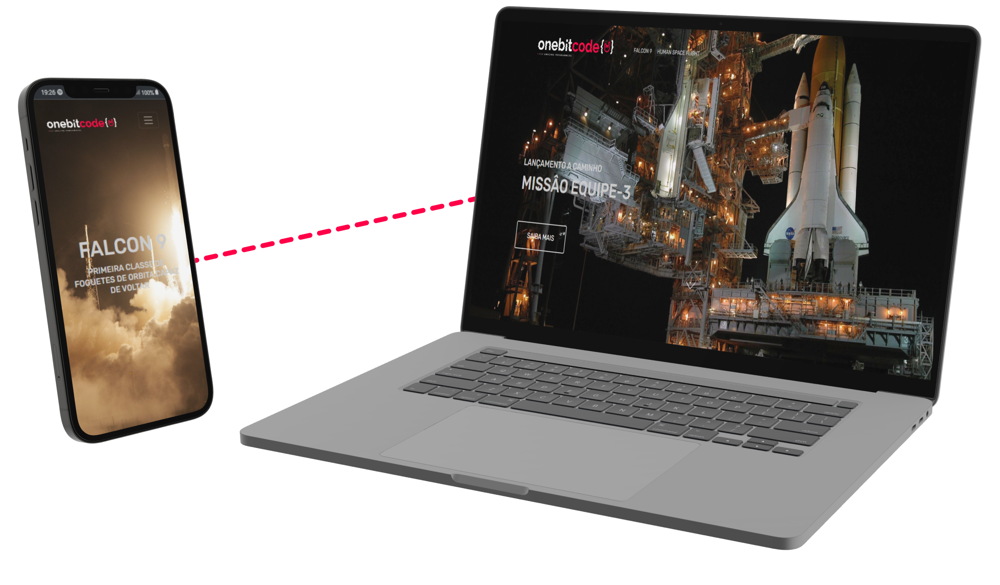

# OneBitCode - OnebitX

> Página construida usando apenas Bootstrap.

> Site construido na aula de Bootstrap da OneBitCode.

- Tabelas
- Manipulção de elementos
- Responsividade
- Animação de texto

## 🛠 Tecnologias

